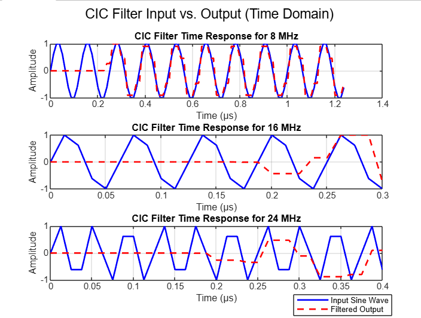

# CIC Filter Implementation on Zybo Z10 FPGA

## Overview
This project implements a **Cascaded Integrator-Comb (CIC) filter** in Verilog and deploys it on a **Zybo Z10 FPGA**. The CIC filter is tested with **sine wave inputs at 8MHz, 16MHz, and 24MHz** and evaluated using MATLAB. This CIC clips off frequencies of 24MHz. CIC filters are used in **high-speed DSP applications** such as **software-defined radio (SDR), audio processing, and high-rate ADC downsampling**.

### **Key Features**
✔ **RTL implementation in Verilog**  
✔ **Deployed on Zybo Z10 FPGA using Vivado**  
✔ **Testbench validation with MATLAB & floating-point sine wave inputs**  
✔ **Time-domain analysis comparing input vs. filtered output**  
✔ **Simulation results and FPGA resource utilization included**  

---

## **Project Structure**
CIC-Filter-Implementation-using-VHDL/
- **src/** *(VHDL source files)*
  - `cic.vhd` *(Main CIC filter implementation)*
- **sim/** *(Simulation outputs)*
  - `cic_tb.vhd` *(Testbench for verification)*
- **matlab/** *(MATLAB scripts for analysis)*
  - `generate_sinewaves.m` *(Generates test sine waves)*
  - `analyze_output.m` *(Plots input vs. filtered output)*
  - `simwave_8MHz.txt`*(Plot for 8MHz sine wave)*
  - `simwave_16MHz.txt`*(Plot for 16MHz sine wave)*
  - `simwave_24MHz.txt`*(Plot for 24MHz sine wave)*
- **zybo_z10_bitstream/** *(FPGA Synthesis files)*
  - `cic.bit` *(Bitstream for Zybo Z10)*
- **reports/** *(FPGA Synthesis files)*
  - `utilization_report.txt` *(FPGA resource utilization)*
  - `timing_report.txt` *(FPGA timing closure results)*
- **Results_and_Waveforms/** *(Waveforms & analysis results)*
  - `cic_tb_behav.wcfg` *(Vivado waveform config)*
  - `CIC_Result_Imput_vs_Output.png` *(MATLAB generated result waveform)*
  - `8MHz.png` *(MATLAB generated waveform)*
  - `16MHz.png` *(MATLAB generated waveform)*
  - `24MHz.png` *(MATLAB generated waveform)*
  - `Block_Diagram.png`
- **LICENSE** *(Open-source license)*

---

## **CIC Filter Implementation**
### **How It Works**
A CIC filter consists of three stages:
1. **Integrator Stages**: Accumulate incoming samples.
2. **Decimation (Downsampling)**: Reduces the data rate.
3. **Comb Stages**: Perform high-pass filtering to remove aliasing.

CIC filters eliminate multipliers, making them highly efficient for **FPGA and ASIC implementations**.

### **Block Diagram**
[Input Signal] --> [Integrator Stages] --> [Downsampling] --> [Comb Stages] --> [Filtered Output]


---

## **MATLAB Simulation & Analysis**
### **1. Generating Test Signals**
The following MATLAB script generates **floating-point sine waves** at 8MHz, 16MHz, and 24MHz, which are later used as FPGA test inputs.

```matlab
clc; clear; close all;

Fs = 80e6; % 80 MHz sampling frequency
T = 1/Fs;

frequencies = [8e6, 16e6, 24e6]; 

for f = frequencies
    num_cycles = lcm(Fs, f) / f; % Ensure exact periodicity
    N = num_cycles * Fs / f; % Total samples needed
    
    t = (0:N-1) * T;
    signal = sin(2 * pi * f * t);

    filename = sprintf('sinewave_%dMHz.txt', f/1e6);
    fid = fopen(filename, 'w');
    fprintf(fid, '%.6f\n', signal);
    fclose(fid);

    % Plot signal
    figure;
    plot(t * 1e6, signal, '-o');
    xlabel('Time (µs)'); ylabel('Amplitude');
    title(sprintf('%d MHz Sine Wave', f/1e6));
    grid on;
end

disp('Sine wave files generated.');
```
### **2. Analyzing FPGA Output**
After processing the sine waves through the CIC filter, the FPGA generates filtered outputs saved as:

output_8MHz.txt
output_16MHz.txt
output_24MHz.txt
The following MATLAB script compares input vs. output signals in the time domain.

```matlab
clc; clear; close all;

Fs = 80e6;
T = 1/Fs;

frequencies = [8e6, 16e6, 24e6];
filenames_input = {'sinewave_8MHz.txt', 'sinewave_16MHz.txt', 'sinewave_24MHz.txt'};
filenames_output = {'output_8MHz.txt', 'output_16MHz.txt', 'output_24MHz.txt'};

figure;
sgtitle('CIC Filter Input vs. Output (Time Domain)');

for i = 1:length(frequencies)
    input_data = load(filenames_input{i});
    output_data = load(filenames_output{i});

    if max(abs(input_data)) > 0
        input_data = input_data / max(abs(input_data));
    end
    if max(abs(output_data)) > 0
        output_data = output_data / max(abs(output_data));
    end

    min_length = min(length(input_data), length(output_data));
    input_data = input_data(1:min_length);
    output_data = output_data(1:min_length);

    t = (0:min_length-1) * T * 1e6;

    subplot(3, 1, i);
    plot(t, input_data, 'b', 'LineWidth', 1.5, 'DisplayName', 'Input Sine Wave');
    hold on;
    plot(t, output_data, 'r--', 'LineWidth', 1.5, 'DisplayName', 'Filtered Output');
    xlabel('Time (µs)'); ylabel('Amplitude');
    title(sprintf('CIC Filter Time Response for %d MHz', frequencies(i)/1e6));
    legend;
    grid on;
end

disp('Input vs. output sine waves plotted.');
```

---
## 📌 Quick Start Guide

### 1️⃣ Running MATLAB Scripts
To generate test sine waves and analyze CIC filter output, run the following scripts in MATLAB:

```matlab
run('matlab/generate_sinewaves.m'); % Generate test signals
run('matlab/analyze_output.m'); % Compare CIC output
```
### 2️⃣ Programming the Zybo Z10 FPGA
After generating the bitstream, auto-connect the Zybo Z10 board and program the device with the generated bitstream (.bit) file.

---
## Example results and Waveforms from Simulation and MATLAB

There are examples of waveforms and results from MATLAB and Vivado as images in the **Results and Waveforms** folder.

Result


---

## **FPGA Implementation on Zybo Z10**
### **1. Synthesis in Vivado**
Target FPGA: Zybo Z10 (Zynq-7000 series)
Vivado Version: 2023.1

### **2. FPGA Resource Utilization**

| Resource    | Usage (%) |
|------------|----------|
| LUTs       | 1.71%      |
| Flip-Flops | 1.41%      |
| Block RAM  | 0.00%      |
| DSP Slices | 0.00%      |

### **3. Timing Analysis**
| Parameter            | Result     |
|----------------------|-----------|
| Max Clock Frequency | 80 MHz    |
| Setup Timing        | Met (0.155ns) |
| Hold Timing         | Met (9.317ns) |

## Future Improvements
✔️ Implement CIC compensation filters for better frequency response correction.
✔️ Add configurable decimation factors via FPGA control registers.
✔️ Improve fixed-point scaling techniques for high-precision filtering.


---

### **License**

This project is licensed under the **MIT License**.  
You are free to modify and distribute it with proper attribution.  
